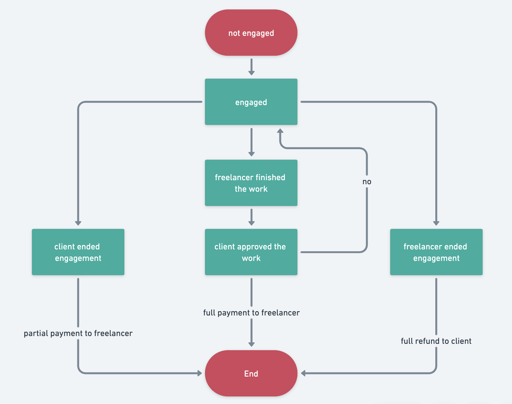

<p align="center"></p>


# de-freelancer
De-Freelancer is a decentralized freelancing broker. With the help of this system freelancers and their clients can work without third-party.

### Contributors:

- Ravshan: [LinkedIn](https://www.linkedin.com/in/rmakhmadaliev/) [GitHub](https://github.com/Ravshann)

#

## Requirements

### Problem Statement

Traditional freelancing platforms are usually:
- Slow in payments
- Scammy
- Expensive 

### Goals

De-Freelancer wants to solve the issues listed above. The smart-contract based is:
- Fast
- Cheap
- Predictable

### Stakeholders

There are 2 kinds of actors:

- Freelancer - professionals with expertise
- Client - project owners who want to pay in eth for freelancers

### Data Structures

De-Freelancer's core smart-contract uses Solidity's built-in `mapping` and `enum` data structures. The main data structure is of type `struct` called _Project_:

```
struct Project{
    address client;
    address freelancer;
    Statuses status;
    string title;
    string description;
    uint256 budget;
    uint256 minimumPayment;
    uint256 creationTimestamp;
    uint256 startedTimestamp;
    bool exists;
}
```

### User Stories

- Clients - cleints get registered when they interact with the system for the first time. A client can create a project. For initiating new project client needs to pass following information to the system: project title, description, budget, minimum payment. Once a client initiates a new project, eth will be sent to smart-contract from client's account at the amount they have given in budget. The system make full refund in case client can't find any freelancer, or freelancer engaged in this project denies to finish the project. If the client decides to end engagement while freelancer is still working on project, the system pays minimum payment to freelancer to compensate spent time and effort of freelancer, the remaining amount locked into engagement is returned to  the client.  
- Freelancers - freelancers can make proposals for projects. If client of project approves their proposal, the freelancer is automatically engaged in the project. During the engagement freelancer can end the engagement without finishing the work, or finish the work and submit for client approval. The first scinario leads to no payment for freelancer, while the second scinario can end with total payment(if client approves). The payment is done automatically by smart-contract.
#

## Architecture

### Project Description

Current version of De-Freelancer consists of following parts:
- Ethereum based Solidity smart-contract
- Firebase document-based database in the cloud
- React frontend

The system can evolve and change all the above listed parts to other technologies depending on the system requirements.

### Functions

| index | Functions                                                       | Description                                                                       |
| ----- | --------------------------------------------------------------- | --------------------------------------------------------------------------------- |
| 1     | registerUser(bool isClient, address addr)                         | users get registered with this endpoint borrowers                                                  |
| 2     | deregisterUser(bool isClient, address \_removeBorrower)                    | users get deregistered with this endpoint                                      |
| 3     | initializeProject(string projectTitle, string description, uint256 budget, uint256 minimumPayment)                                                  | Clients initialize the project                                                       |
| 4     | setFreelancerAndEngage(uint256 id, address freelancer)                                             | once client chooses freelancer to work with, project status changes to ENGAGED and freelancer address will be set                                                     |
| 5     | endEngagement(uint256 id)                                              | freelancer or client of project can end the project in the ENGAGED status                                             |
| 6     | finishProject(uint256 id)                                                   | this method is called only by freelancers, for finishing the project                                     |
| 7     | approveOrDisapproveProject(uint256 id, bool approved)                               | only client of  project can approve or disapprove the finished work. Approved work means full payment for freelancer and ending the engagement. Disapproved work returns the status of project back to ENGAGED .                                                               |
| 8     | makePayment(uint256 amount, address receiver)                                             | internal method for making payments, this method can't be called externally                                                       |


### System Diagram


### Flow Diagram



### Tech-stack

Smart-contract in Solidity language, Ethereum blockchain
Frontend is in React.js.
Firebase Firestore cloud is used as database. 

#

## Project Plan

The total time estimate for this project is approximately 2-3 months. 

NOTICE: The project is not fully developed at the moment, and there are many more plans for expansion.


## Installation guide

### Prerequisites
1. Metamask account

### Step 1 - add test network in Metamask
To deploy smart-contracts and interact with our test-network we have to connect it to Metamask account.